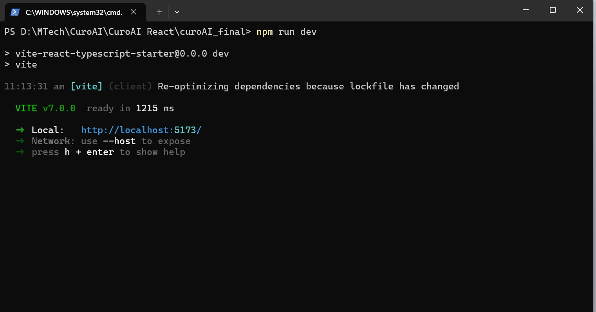
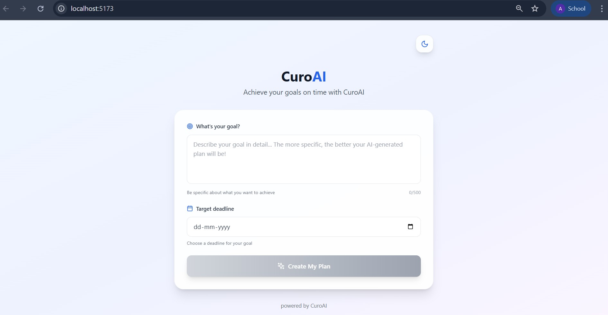
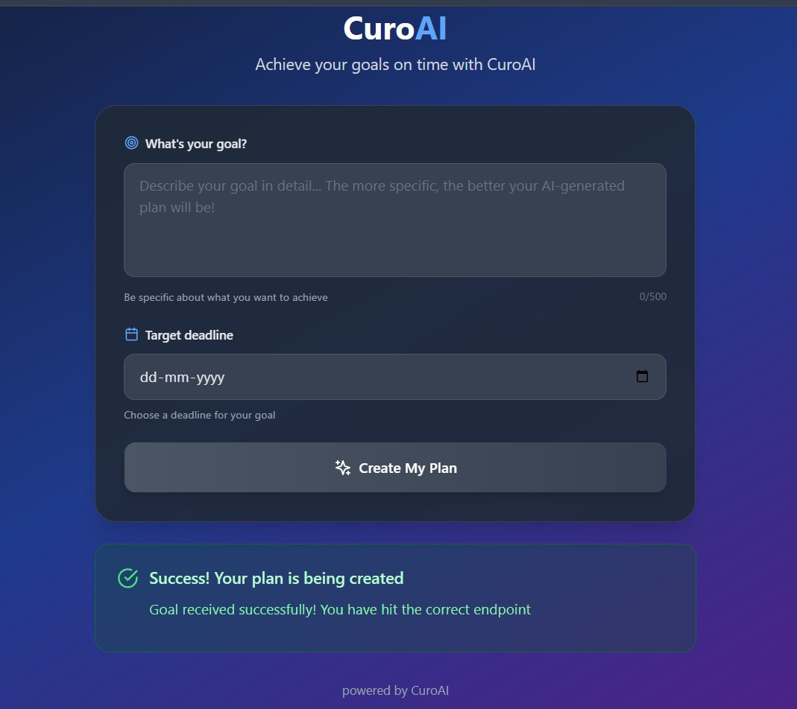

# CuroAI - Goal Submission App

CuroAI is a single-page React + TypeScript application that allows users to submit a goal and a target date. The app sends this information to a mock API, and displays a response confirming successful goal creation.

---

## Screenshots

### Run CMD


### Light Mode


### Dark Mode


### Success Response


---
## Features

- Submit a goal description with deadline
- POST request to mock API
- Light & dark mode toggle
- Form validation (empty fields, future date)
- Responsive design
- Loading spinner & error handling

---

## Tech Stack

| Layer       | Technology            |
|-------------|-----------------------|
| UI          | React 18 + TypeScript |
| Styling     | Tailwind CSS          |
| Icons       | Lucide React          |
| Build Tool  | Vite                  |
| API Testing | Beeceptor (mock API)  |

---

## Design Choices

### Component Logic
- `App.tsx` handles all logic using React hooks (`useState`, `useEffect`).
- Input values (`goalDescription`, `targetDate`) are stored in state.
- On "Create My Plan" click, a POST request is sent using `fetch()` to the API.

### Theme Support
- Uses system preference by default (detected with `window.matchMedia`).
- Manual toggle updates `localStorage` and the HTML class (`dark`).

### API Integration
- Endpoint: `https://curoai.free.beeceptor.com/goals`
- Headers: `Content-Type: application/json`
- Status: Success on `201`, errors displayed otherwise

---

## How to Run it Locally

```bash
git clone https://github.com/your-username/curoai-goal-submission
cd curoai-goal-submission
npm install
npm run dev
